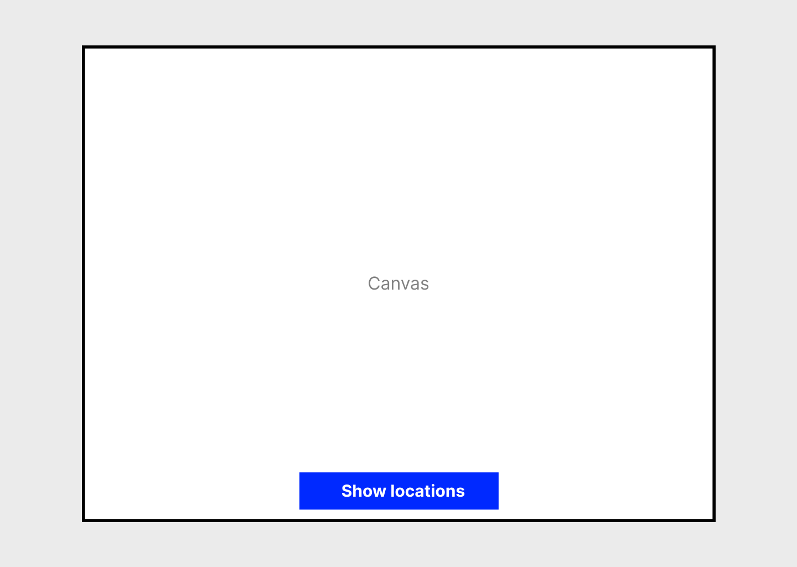
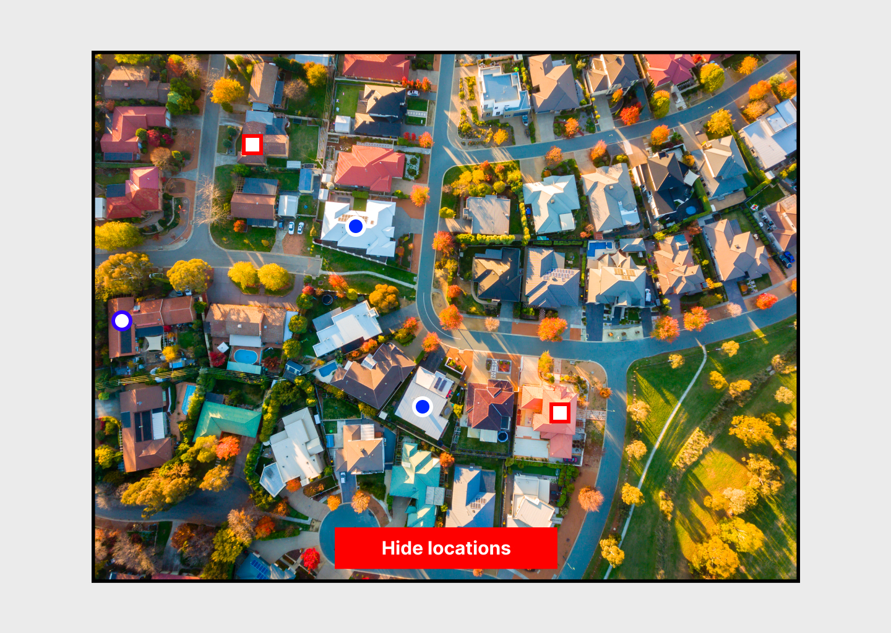

# LARP Game app

You are given a small starter app with the following setup:

-   [React](https://react.dev/)
-   [Redux](https://redux.js.org/)
-   [Leaflet](https://leafletjs.com/)
-   [Fabric](http://fabricjs.com/)

These are the main libraries we use in the frontend of the Solar Monkey app.

## Installation

```sh
yarn install
```

## To test

```sh
yarn test
```

## To run

```sh
yarn start
```

## Instructions

This is an app to track locations of players for [LARPing](https://en.wikipedia.org/wiki/Live_action_role-playing_game). The app is to be used by the game master, and starts with a set of initial locations of all players which is stored in the Redux store. The app should show the locations provided in the Redux store on a Leaflet map that is drawn on an HTML canvas.

Leaflet uses OpenStreetMap for its map tiles by default, however, they are a volunteer-run non-profit body and cannot supply tiles for large-scale commercial use. Please use this mapbox API instead. [See the documentation here](https://docs.mapbox.com/help/glossary/mapbox-satellite/). You can use [this endpoint](https://api.mapbox.com/styles/v1/mapbox/satellite-v9) in a `Leaflet.tileLayer`.

When you first load the page, you will see the starting point:



When a user clicks the "Show locations" button, the locations are displayed over the map as Fabric’s circle and square objects, to represent two different teams, as shown here:



The button should now say "Hide locations". If a user clicks it now, it will hide the locations.

When a player is hit, it should be possible to click the location of the player to delete it and signal they are out of the game. When this happens, the circle disappears visually from the canvas and the location should be removed from the Redux store.

The locations are stored as objects with an id, name, position (latitude and longitude) and team name.

Please take into account the resizing and the positioning of the fabric objects when zooming in and out and when moving the map. You can use this helper function to calculate the right positions of the objects.

```ts
function getResolution(center: any, zoom: number) {
    // Resolution in meters per pixel. 40075016 is the length of the equator in meters.
    return (
        (Math.cos((center.lat * Math.PI) / 180) * 40075016) /
        (256 * Math.pow(2, zoom))
    );
}
```

## Requirements

-   We are searching for robust, readable and tested code that follows best practices.

-   A starting point is provided for you, it uses the libraries and tech stack that you will be working with when you join us. We also work heavily on an HTML canvas. Feel free to add any other dependencies that you need.

-   Feel free to rename the functions provided, and to add more functions or delete the functions provided. You can also improve the code provided.

-   A test setup is provided. Add as many tests as you need to document any new behaviour you add.

-   We would also like to see a clean git history that tells the story of your changes.

-   You can send us a link to your forked repository, or you can also send us a ZIP with your solution if you prefer. Please do this **at least one day before the interview**.

We hope you have fun with the exercise!
